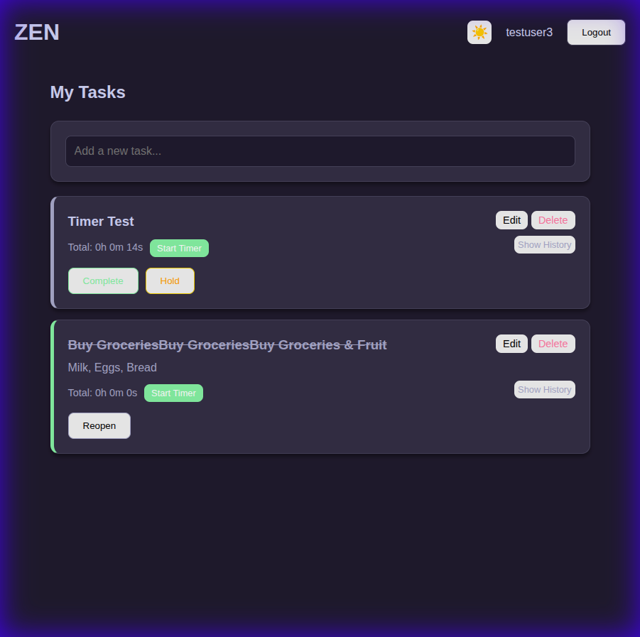
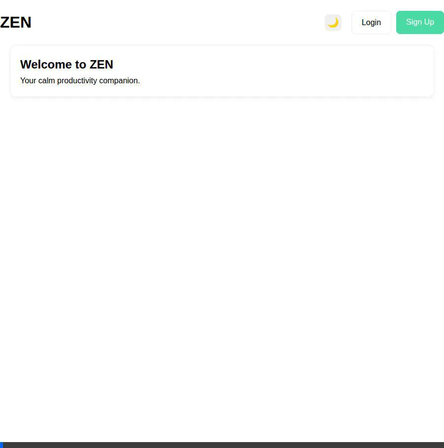
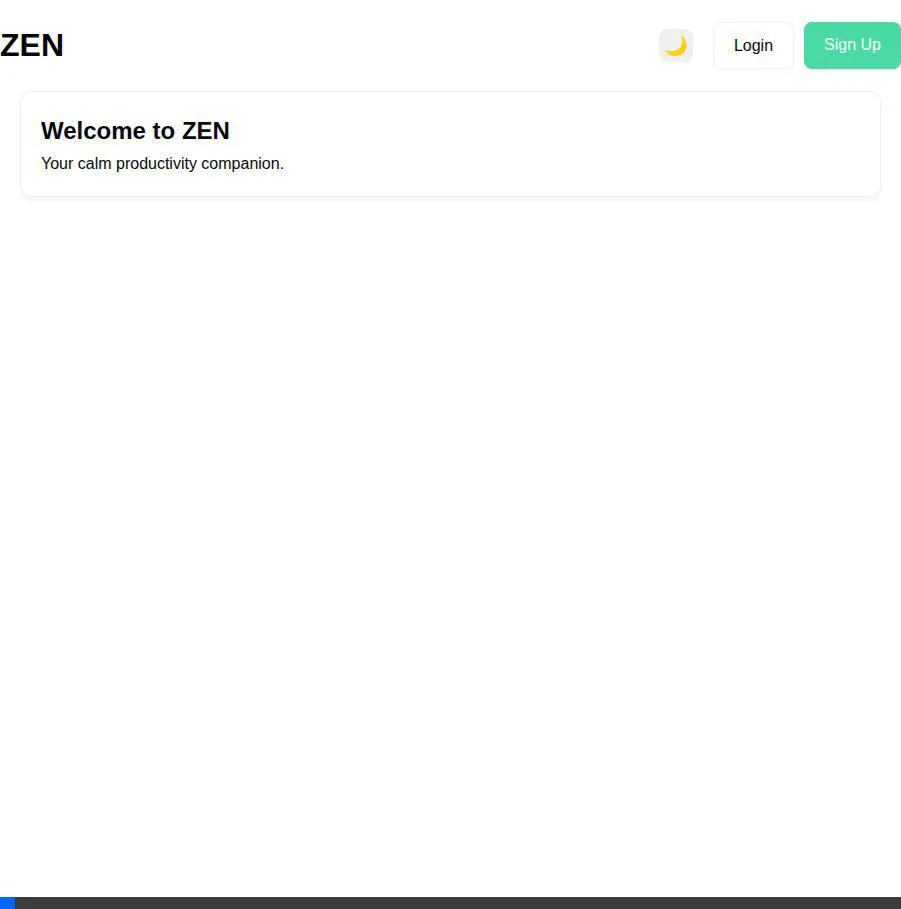

# ZEN Task Management App

ZEN is a modern, intuitive, and productivity-focused task management application. It features a calm aesthetic, robust task tracking, time logging, and a responsive design with multiple themes (Light, Dark, Catppuccin).



## Features

- **Authentication**: Secure user registration and login with JWT.
- **Task Management**: Create, read, update, and delete tasks.
- **Task Actions**: Complete, hold (with comments), and reopen tasks.
- **Timer & Time Logging**: Track time spent on tasks with a built-in timer. View detailed history logs.
- **Themes**: Switch between Light, Dark, and Catppuccin themes.
- **Responsive Design**: Optimized for desktop and mobile.
- **Dockerized**: Easy deployment with Docker Compose.

## Tech Stack

- **Frontend**: React, Vite, Axios, CSS Variables
- **Backend**: Node.js, Express, Sequelize (SQLite)
- **Containerization**: Docker, Nginx

## Getting Started

### Prerequisites

- Node.js (v18+)
- Docker & Docker Compose (optional, for containerized run)

### Local Development

1.  **Clone the repository**
    ```bash
    git clone <repository-url>
    cd zen-task-app
    ```

2.  **Install Dependencies**
    ```bash
    # Server
    cd server
    npm install

    # Client
    cd ../client
    npm install
    ```

3.  **Start the Application**
    ```bash
    # Terminal 1: Server
    cd server
    npm run dev

    # Terminal 2: Client
    cd client
    npm run dev
    ```

4.  Open `http://localhost:5173` in your browser.

### Docker Deployment

Run the application in a single container (Node.js serving React build):

```bash
docker compose up --build -d
```

Open `http://localhost:8080` in your browser.

## Demos

### Authentication Flow
Sign up, login, and profile management.


### Task Management
Create, edit, complete, and delete tasks.


### Timer Functionality
Start/stop timer and view total time.


### History & Themes
View time logs and toggle themes.


## License

MIT
